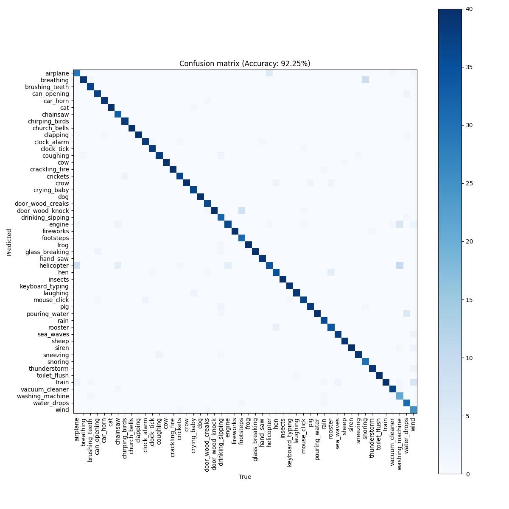

# DL_2023_CLAP
Experiments on the CLAP model for the DL course at IMTA (2023-2024)

## Installation
To download all the datasets, run the ```dataset.sh``` script.

## Datasets
We use the following datasets :
- [ESC-50](https://www.karolpiczak.com/papers/Piczak2015-ESC-Dataset.pdf) : 50 classes of environmental sounds, 2000 samples, 5 seconds each.
- [UrbanSound8K](https://urbansounddataset.weebly.com/urbansound8k.html) : 10 classes of urban sounds, 8732 samples, 4 seconds each.
- [FMA-Small](https://arxiv.org/pdf/1612.01840.pdf) : 8 genres of music, 8000 samples, 30 seconds each.
## A few experiments results

Running the ```main.py``` script over the whole ESC-50 dataset on a GTX1060, consumes : ```1321MiB /  6144MiB``` of GPU RAM and takes less than 20 minutes to complete.

### Last audio processed
Image of the last audio processed by the model.


### Confusion matrix of the model over the ESC-50 dataset (raw labels)


### Confusion matrix of the model over the ESC-50 dataset (augmented labels)

We also tried to augment the labels of the ESC-50 dataset, by turning words into full sentences. For example, the label ```dog``` becomes ```A dog is barking```. The idea is to give more context to the model, and to make it learn more about the meaning of the sounds.



We gained more than 10% of accuracy, and the confusion matrix looks better.