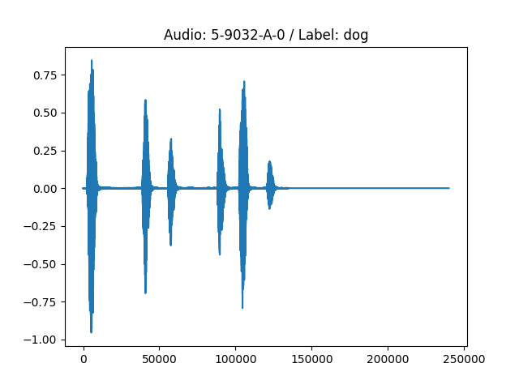
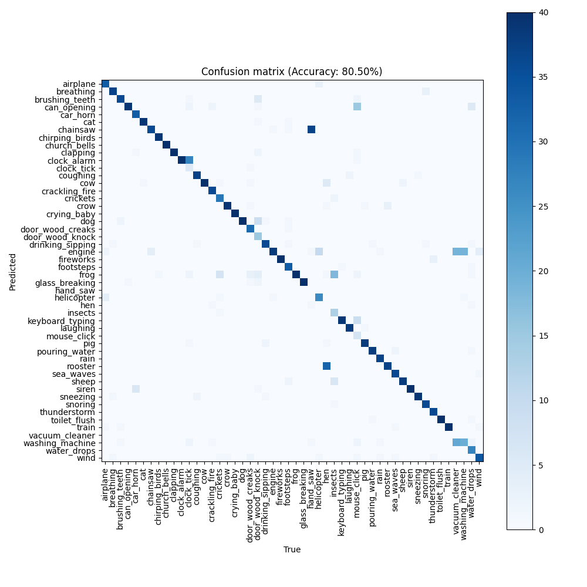
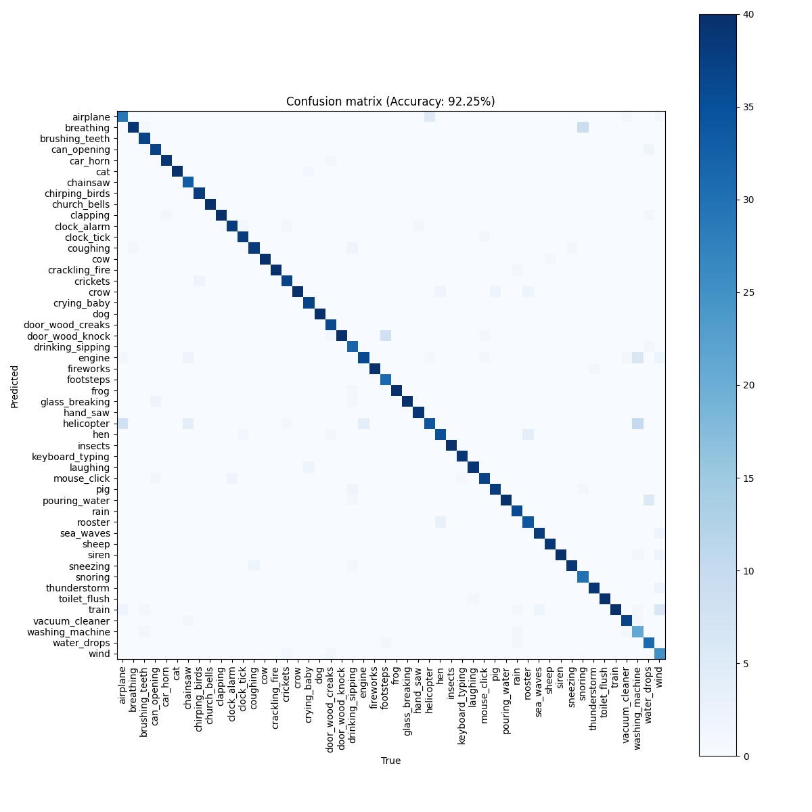
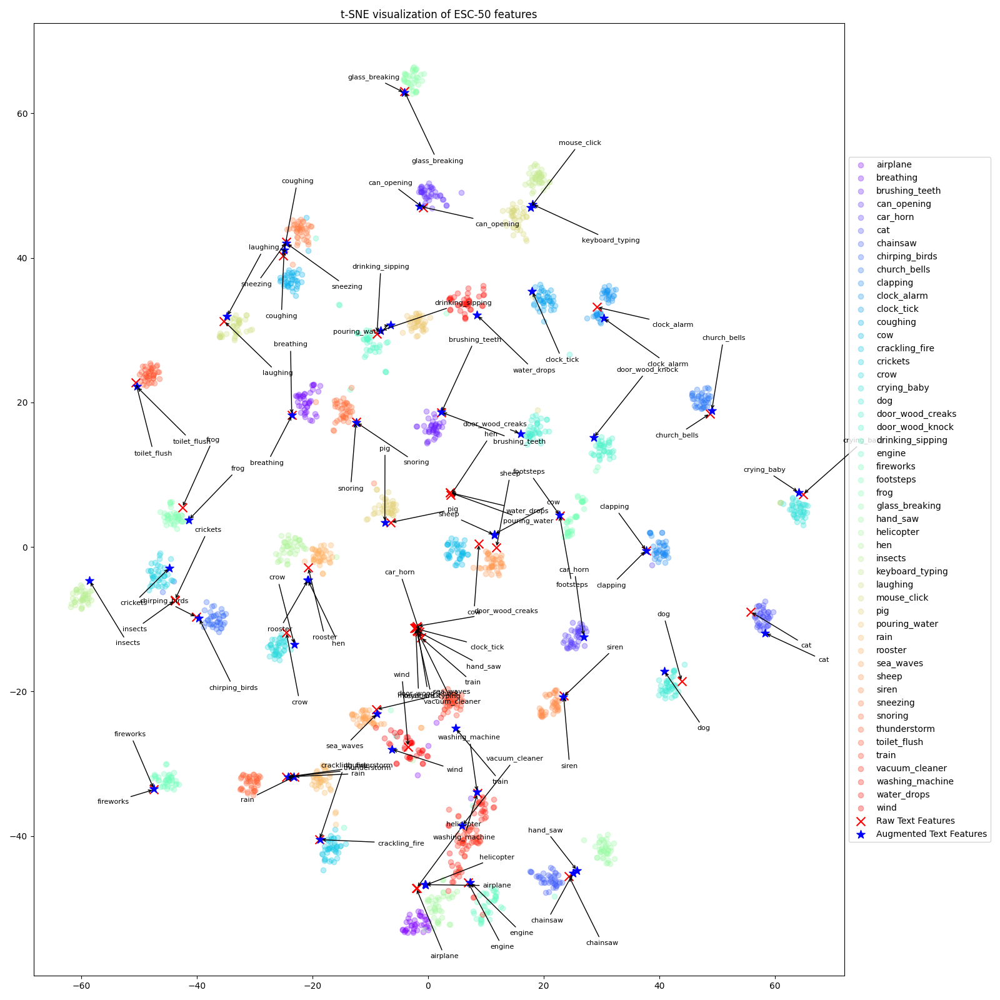
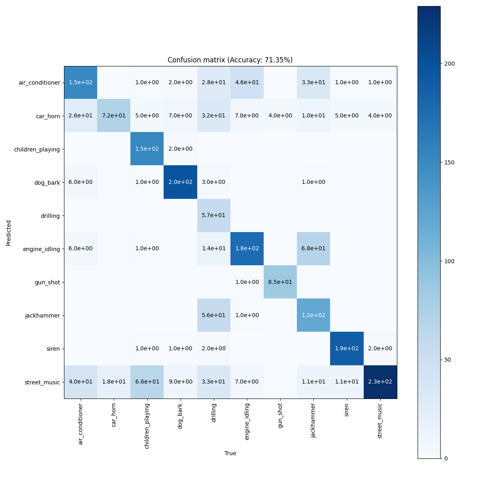
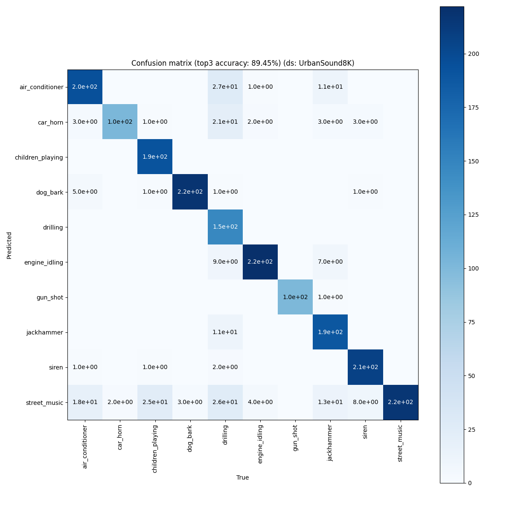
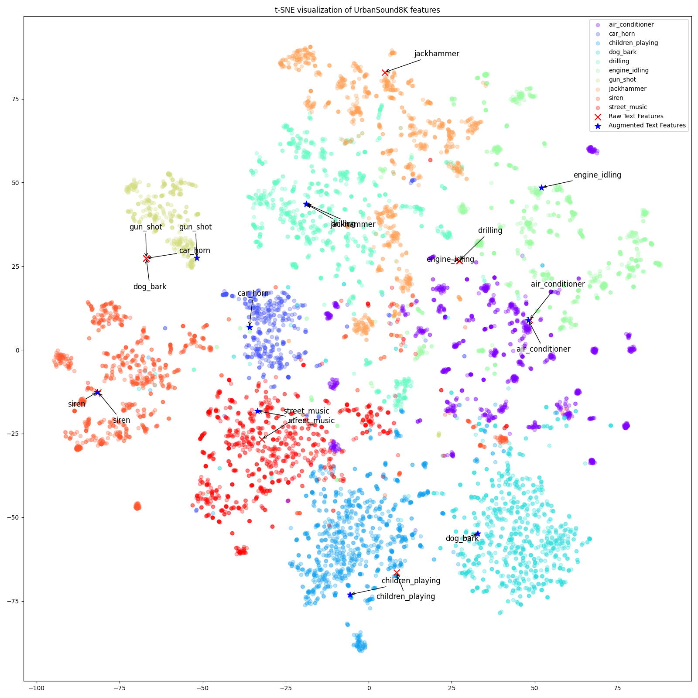
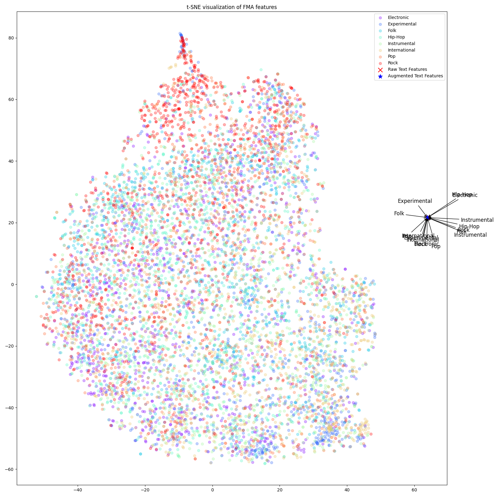
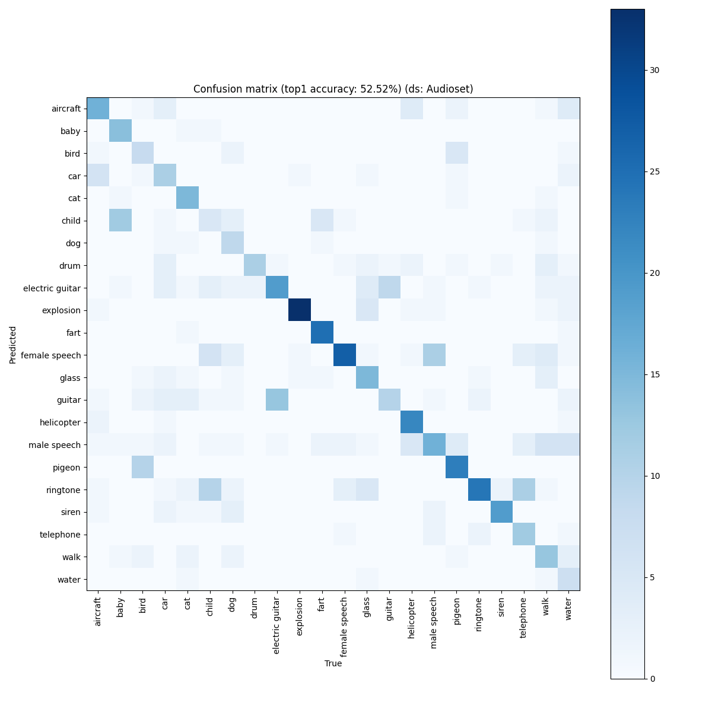
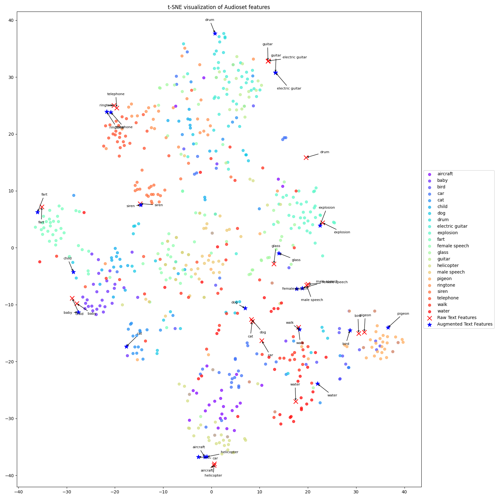

# DL_2023_CLAP
Experiments on the CLAP model for the DL course at IMTA (2023-2024)

## Installation
To download all the datasets, run the ```dataset.sh``` script.

## Usage
cf. [this page](usage.md)

## Datasets
We use the following datasets :
- [ESC-50](https://www.karolpiczak.com/papers/Piczak2015-ESC-Dataset.pdf) : 50 classes of environmental sounds, 2000 samples, 5 seconds each.
- [UrbanSound8K](https://urbansounddataset.weebly.com/urbansound8k.html) : 10 classes of urban sounds, 8732 samples, 4 seconds each.
- [FMA-Small](https://arxiv.org/pdf/1612.01840.pdf) : 8 genres of music, 8000 samples, 30 seconds each.
- [AudioSet](https://research.google.com/audioset/) : 527 classes of sounds, 2 084 320 samples, 10 seconds each. However, we only use a subset of a few classes (see figure below).

# Experiments
## Last audio processed
Image of the last audio processed by the model (from the ESC-50 dataset).



## A few experiments results on the ESC-50 dataset

Running the ```main.py``` script over the whole ESC-50 dataset on a GTX1060, consumes : ```1321MiB /  6144MiB``` of GPU RAM and takes less than 20 minutes to complete.

### Confusion matrix of the model over the ESC-50 dataset (raw labels)



### Confusion matrix of the model over the ESC-50 dataset (augmented labels)

We also tried to augment the labels of the ESC-50 dataset, by turning words into full sentences. For example, the label ```dog``` becomes ```A dog is barking```. The idea is to give more context to the model, and to make it learn more about the meaning of the sounds.



We gained more than 10% of accuracy, and the confusion matrix looks better.

### t-SNE visualization of the ESC-50 dataset + labels



## A few experiments results on the UrbanSound8K dataset

On 2000 samples of the UrbanSound8K dataset, the model takes about 35 minutes to run on a GTX1060.

### Confusion matrix of the model over the UrbanSound8K dataset (2000 samples, augmented labels, top 1 accuracy)



### Confusion matrix of the model over the UrbanSound8K dataset (2000 samples, augmented labels, top 3 accuracy)



### t-SNE visualization of the UrbanSound8K dataset + labels




## A few experiments results on the FMA-Small dataset
The accuracy on the FMA-Small dataset is very low, we think this might be related to poor labels. We tried to augment the labels, but it didn't improve the accuracy by much.

### t-SNE visualization of the FMA-Small dataset + labels


The labels are very far from the features, which might explain the poor accuracy.

## A few experiments results on the AudioSet dataset

### Confusion matrix of the model over the AudioSet dataset (~600 samples, augmented labels, top 1 accuracy)



### t-SNE visualization of the AudioSet dataset + labels

