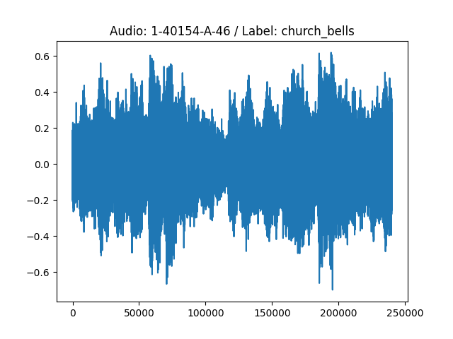
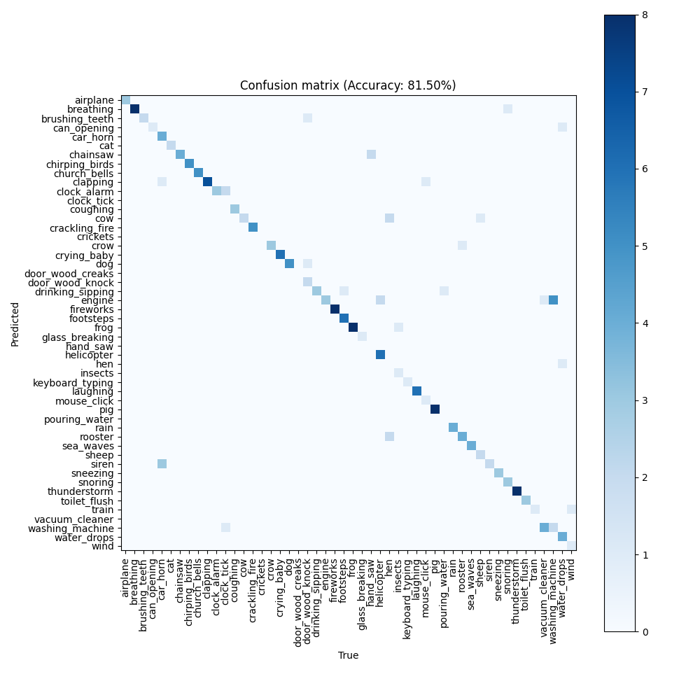

# DL_2023_CLAP
Experiments on the CLAP model for the DL course at IMTA (2023-2024)

## A few experiments results

Running the ```main.py``` script over the whole ESC-50 dataset on a GTX1060 consumes : ```1321MiB /  6144MiB``` of GPU RAM and takes 23 minutes to complete.

### Last audio processed
Image of the last audio processed by the model.



### Confusion matrix of the model over the ESC-50 dataset


