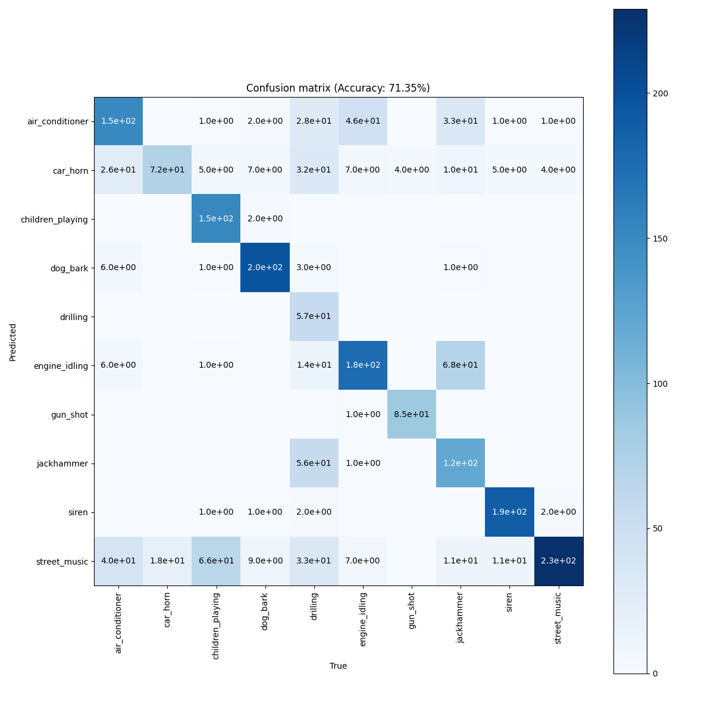

# DL_2023_CLAP
Experiments on the CLAP model for the DL course at IMTA (2023-2024)

## Installation
To download all the datasets, run the ```dataset.sh``` script.

## Datasets
We use the following datasets :
- [ESC-50](https://www.karolpiczak.com/papers/Piczak2015-ESC-Dataset.pdf) : 50 classes of environmental sounds, 2000 samples, 5 seconds each.
- [UrbanSound8K](https://urbansounddataset.weebly.com/urbansound8k.html) : 10 classes of urban sounds, 8732 samples, 4 seconds each.
- [FMA-Small](https://arxiv.org/pdf/1612.01840.pdf) : 8 genres of music, 8000 samples, 30 seconds each.

## Usage
### the ```main.py``` script
The ```main.py``` script is the main script of the project. It allows inference over the selected dataset.

To run the script, you need to specify the following arguments :
- ```--dataset``` (or ```-d```) : the dataset to use. Possible values are ```esc50```, ```urbansound8k``` and ```fma```. (shortcuts : ```e```, ```u``` and ```f```)
- ```--limit``` (or ```-l```) : the number of samples to use. (default : ```-1```, which means all the samples)
- ```--plot``` (or ```-p```) : what to plot. Possible values are ```no```, ```cm```, ```audio``` and ```all```. (default : ```no```)
- ```--model``` (or ```-m```) : the model to use. Possible values are ```default```, ```general``` and ```music```. ("laion/clap-htsat-unfused" for general and "laion/larger_clap_music" for music). Default is will automatically choose the model depending on the dataset. (default : ```default```)
-  ```--verbose``` (or ```-v```) : whether to print the progress or not. (default : ```False```)

# Experiments
## Last audio processed
Image of the last audio processed by the model.


## A few experiments results on the ESC-50 dataset

Running the ```main.py``` script over the whole ESC-50 dataset on a GTX1060, consumes : ```1321MiB /  6144MiB``` of GPU RAM and takes less than 20 minutes to complete.

### Confusion matrix of the model over the ESC-50 dataset (raw labels)


### Confusion matrix of the model over the ESC-50 dataset (augmented labels)

We also tried to augment the labels of the ESC-50 dataset, by turning words into full sentences. For example, the label ```dog``` becomes ```A dog is barking```. The idea is to give more context to the model, and to make it learn more about the meaning of the sounds.


We gained more than 10% of accuracy, and the confusion matrix looks better.

## A few experiments results on the UrbanSound8K dataset

On 2000 samples of the UrbanSound8K dataset, the model takes about 35 minutes to run on a GTX1060.

### Confusion matrix of the model over the UrbanSound8K dataset (augmented labels)

